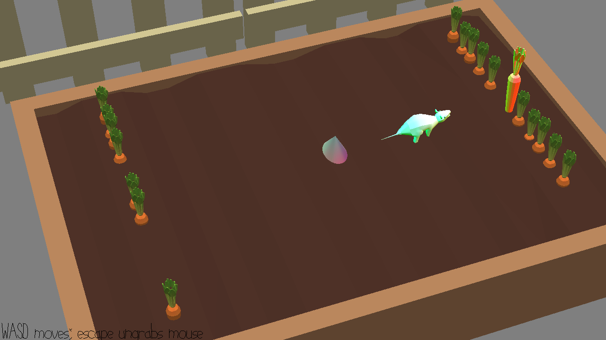

# Chemical Mouse

Author: Chunan(Oscar) Huang

Design: 
You, a mouse, is trying to steal some carrots that are poisoned by chemicals.
You gain chemical power from every carrot you eat and move faster.
Guess what happen when you eat all the carrots :)
(ps. there are 2 POSSIBLE ENDINGS!!!. Check line94 in PlayMode.cpp if curious about the condition)

Screen Shot:

How To Play:

WASD to mouse, left click on mouse to collect.

Sources: 
The main scene is adapted from garden.blend created by Yixin He.
Game developed from base code:  https://github.com/15-466/15-466-f21-base2
Model Credits: https://github.com/15-466/15-466-f21-base2/blob/main/scenes/CREDITS.txt

This game was built with [NEST](NEST.md).

